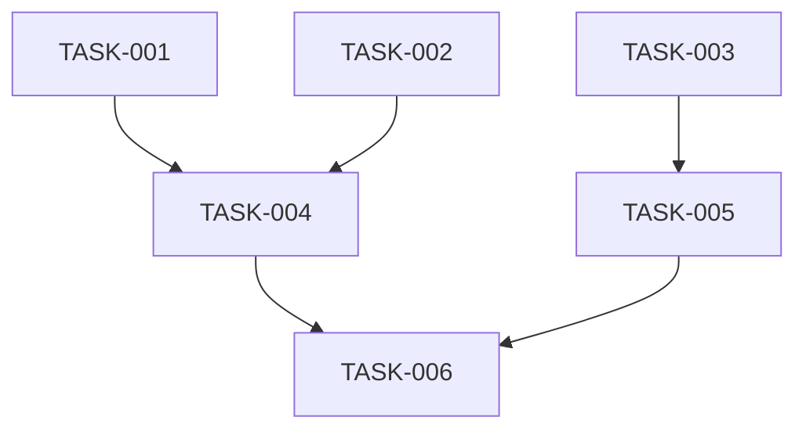

# [Project Name] - Execution Plan

**Version**: 1.0
**Date**: [Date]
**Author**: [Author]

---

## 1. Plan Overview

### 1.1 Project Summary
[Brief description of the project and its goals]

### 1.2 Timeline
- **Start Date**: [Date]
- **Target End Date**: [Date]
- **Total Duration**: [Duration]

### 1.3 Resource Requirements
- **Skills Needed**: [List of skills]
- **Team Size**: [Number]
- **Tools and Services**: [List]

### 1.4 External Dependencies
- [Dependency 1]: [Description and timeline]
- [Dependency 2]: [Description and timeline]

---

## 2. Task List

### Priority Levels
- **P0** (Critical): Must be completed, blocks other tasks
- **P1** (High): Important, should be completed early
- **P2** (Medium/Low): Nice to have, can be deferred

### Tasks

#### TASK-001: [Task Title]
**Priority**: P0/P1/P2

**Description**:
[Detailed description of what needs to be done]

**Acceptance Criteria**:
- [ ] [Criterion 1]
- [ ] [Criterion 2]
- [ ] [Criterion 3]

**Dependencies**: None / [TASK-XXX], [TASK-XXX]

**Estimated Effort**: [Time estimate]

**Implementation Notes**:
[Specific guidance, considerations, or constraints]

---

#### TASK-002: [Task Title]
**Priority**: P0/P1/P2

**Description**:
[Detailed description of what needs to be done]

**Acceptance Criteria**:
- [ ] [Criterion 1]
- [ ] [Criterion 2]
- [ ] [Criterion 3]

**Dependencies**: [TASK-XXX], [TASK-XXX]

**Estimated Effort**: [Time estimate]

**Implementation Notes**:
[Specific guidance, considerations, or constraints]

---

#### TASK-003: [Task Title]
**Priority**: P0/P1/P2

**Description**:
[Detailed description of what needs to be done]

**Acceptance Criteria**:
- [ ] [Criterion 1]
- [ ] [Criterion 2]
- [ ] [Criterion 3]

**Dependencies**: None / [TASK-XXX], [TASK-XXX]

**Estimated Effort**: [Time estimate]

**Implementation Notes**:
[Specific guidance, considerations, or constraints]

---

[Continue for all tasks...]

---

## 3. Milestones

### Milestone 1: [Milestone Name]
**Target Date**: [Date]

**Tasks Included**:
- [TASK-001] [Task Title]
- [TASK-002] [Task Title]
- [TASK-003] [Task Title]

**Deliverables**:
- [Deliverable 1]
- [Deliverable 2]

**Success Criteria**:
- [Criterion 1]
- [Criterion 2]

---

### Milestone 2: [Milestone Name]
**Target Date**: [Date]

**Tasks Included**:
- [TASK-004] [Task Title]
- [TASK-005] [Task Title]
- [TASK-006] [Task Title]

**Deliverables**:
- [Deliverable 1]
- [Deliverable 2]

**Success Criteria**:
- [Criterion 1]
- [Criterion 2]

---

[Continue for all milestones...]

---

## 4. Task Dependency Graph

### Parallel Execution Opportunities

**Batch 1** (can be executed in parallel):
- [TASK-001]
- [TASK-002]
- [TASK-003]

**Batch 2** (depends on Batch 1):
- [TASK-004]
- [TASK-005]

**Batch 3** (depends on Batch 2):
- [TASK-006]

---

## 5. Progress Tracking

### Task Status

| Task ID | Task Title | Priority | Status | Assigned To | Start Date | End Date | Time Spent |
|---------|-----------|----------|---------|-------------|------------|-----------|------------|
| TASK-001 | [Title] | P0 | Pending | - | - | - | - |
| TASK-002 | [Title] | P0 | Pending | - | - | - | - |

### Milestone Progress

| Milestone | Target Date | Status | Completed Tasks | Total Tasks | % Complete |
|-----------|-------------|---------|-----------------|-------------|------------|
| [Milestone 1] | [Date] | Not Started | 0 | 3 | 0% |
| [Milestone 2] | [Date] | Not Started | 0 | 3 | 0% |

---

## 6. Risk Management

### 6.1 Task-Specific Risks

| Task | Risk | Likelihood | Impact | Mitigation |
|------|-------|------------|---------|------------|
| TASK-001 | [Risk] | High/Medium/Low | High/Medium/Low | [Strategy] |
| TASK-002 | [Risk] | High/Medium/Low | High/Medium/Low | [Strategy] |

### 6.2 Schedule Risks
- [Risk]: [Mitigation strategy]
- [Risk]: [Mitigation strategy]

### 6.3 Resource Risks
- [Risk]: [Mitigation strategy]
- [Risk]: [Mitigation strategy]

---

## 7. Quality Assurance

### 7.1 Testing Strategy
- [Strategy for unit tests]
- [Strategy for integration tests]
- [Strategy for end-to-end tests]

### 7.2 Code Review Process
- [Description of review process]
- [Review criteria]
- [Approval workflow]

### 7.3 Definition of Done
A task is considered done when:
- [ ] All acceptance criteria met
- [ ] Code reviewed and approved
- [ ] All tests passing
- [ ] Documentation updated
- [ ] Linting passes
- [ ] Deployed to staging

---

## 8. Communication Plan

### 8.1 Regular Updates
- [Frequency]: [Daily/Weekly]
- [Format]: [Stand-up/Email/Slack]
- [Participants]: [List]

### 8.2 Stakeholder Communication
- [Stakeholder]: [Communication frequency and format]

### 8.3 Issue Escalation
- [Escalation path]
- [Escalation criteria]

---

## 9. Change Management

### 9.1 Change Request Process
1. [Step 1]
2. [Step 2]
3. [Step 3]

### 9.2 Impact Assessment
For any change request:
- Impact on timeline
- Impact on resources
- Impact on dependencies
- Risk assessment

### 9.3 Approval Process
- [Who approves changes]
- [Approval criteria]

---

## 10. Post-Implementation

### 10.1 Deployment Checklist
- [ ] All tests passing
- [ ] Code reviewed
- [ ] Documentation updated
- [ ] Staging deployment verified
- [ ] Rollback plan ready
- [ ] Monitoring configured

### 10.2 Validation
- [ ] Smoke tests passed
- [ ] Feature validation completed
- [ ] Performance validated
- [ ] Security review passed

### 10.3 Monitoring
- [ ] Metrics monitored for [duration]
- [ ] Alerts configured
- [ ] Log review scheduled

### 10.4 Retrospective
- Schedule retrospective for [date]
- Collect feedback from team
- Document lessons learned
- Identify improvements for next iteration

---

## Appendix

### A. Task Templates
[Standardized task template for consistent task creation]

### B. Definitions
- **Priority**: [Definition]
- **Effort**: [Definition]
- **Status**: [Definition]

### C. Change Log

| Version | Date | Author | Changes |
|---------|------|--------|---------|
| 1.0 | [Date] | [Author] | Initial version |
