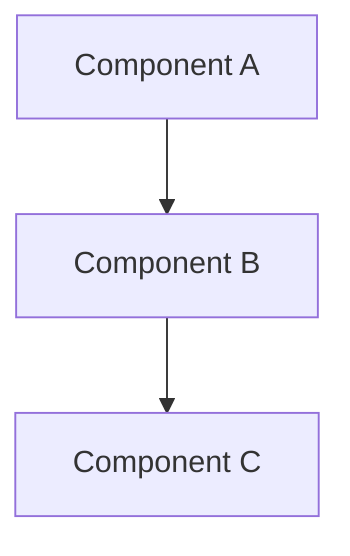

# [Project Name] - Technical Design Document

**Version**: 1.0
**Date**: [Date]
**Author**: [Author]

---

## 1. Project Overview

### 1.1 Problem Statement
[Describe the problem this project solves]

### 1.2 Solution Approach
[High-level description of the solution]

### 1.3 Key Features
- [Feature 1]
- [Feature 2]
- [Feature 3]

### 1.4 Target Users
[Describe who will use this project]

---

## 2. Requirements

### 2.1 Functional Requirements
- [FR-001] [Requirement description]
- [FR-002] [Requirement description]
- [FR-003] [Requirement description]

### 2.2 Non-Functional Requirements

#### Performance
- [Requirement]: [Value/Goal]

#### Scalability
- [Requirement]: [Value/Goal]

#### Security
- [Requirement]: [Value/Goal]

#### Reliability
- [Requirement]: [Value/Goal]

#### Availability
- [Requirement]: [Value/Goal]

### 2.3 Constraints
- [Constraint 1]
- [Constraint 2]
- [Constraint 3]

### 2.4 Assumptions
- [Assumption 1]
- [Assumption 2]

---

## 3. Architecture

### 3.1 High-Level Architecture
[Describe overall system architecture]



### 3.2 Component Breakdown

#### [Component 1]
- **Purpose**: [Description]
- **Responsibilities**: [List]
- **Interfaces**: [List]
- **Dependencies**: [List]

#### [Component 2]
- **Purpose**: [Description]
- **Responsibilities**: [List]
- **Interfaces**: [List]
- **Dependencies**: [List]

### 3.3 Data Flow
[Describe how data flows through the system]

### 3.4 External Integrations
- [Integration 1]: [Description]
- [Integration 2]: [Description]

---

## 4. Data Model

### 4.1 Entities

#### [Entity 1]
```
Entity Name
├── field1: Type
├── field2: Type
└── field3: Type
```

- **Description**: [Description]
- **Relationships**: [List of relationships]

#### [Entity 2]
```
Entity Name
├── field1: Type
├── field2: Type
└── field3: Type
```

- **Description**: [Description]
- **Relationships**: [List of relationships]

### 4.2 Database Schema
[Provide detailed database schema if applicable]

### 4.3 Storage Strategy
- [Storage type]: [Description]
- [Backup strategy]: [Description]
- [Data retention]: [Description]

---

## 5. API Design

### 5.1 API Overview
[Describe overall API design (REST, GraphQL, gRPC, etc.)]

### 5.2 Endpoints

#### [Endpoint 1]
- **Method**: GET/POST/PUT/DELETE
- **Path**: `/api/v1/resource`
- **Description**: [Description]
- **Authentication**: [Required/Not required]
- **Request**:
  ```json
  {
    "field": "value"
  }
  ```
- **Response**:
  ```json
  {
    "field": "value"
  }
  ```
- **Error Codes**: [List]

#### [Endpoint 2]
- **Method**: GET/POST/PUT/DELETE
- **Path**: `/api/v1/resource`
- **Description**: [Description]
- **Authentication**: [Required/Not required]
- **Request**:
  ```json
  {
    "field": "value"
  }
  ```
- **Response**:
  ```json
  {
    "field": "value"
  }
  ```
- **Error Codes**: [List]

### 5.3 Authentication & Authorization
- **Authentication Method**: [JWT, OAuth, API Key, etc.]
- **Authorization Strategy**: [RBAC, ABAC, etc.]
- **Token Management**: [Description]

---

## 6. Security Considerations

### 6.1 Threat Model
- [Threat 1]: [Description and mitigation]
- [Threat 2]: [Description and mitigation]

### 6.2 Security Controls

#### Input Validation
- [Description]

#### Output Encoding
- [Description]

#### Authentication
- [Description]

#### Authorization
- [Description]

#### Data Encryption
- [Description]

#### Logging and Monitoring
- [Description]

### 6.3 Compliance Requirements
- [Compliance standard]: [Requirements]

### 6.4 Secrets Management
- [Description of how secrets are stored and accessed]

---

## 7. Technology Stack

### 7.1 Languages
- [Language]: [Version]

### 7.2 Frameworks
- [Framework]: [Version and usage]

### 7.3 Databases
- [Database]: [Version and usage]

### 7.4 Infrastructure
- [Component]: [Description]
- [Component]: [Description]

### 7.5 Libraries and Tools
- [Library]: [Purpose]
- [Library]: [Purpose]

---

## 8. Deployment Strategy

### 8.1 Environment Setup

#### Development
- [Description]

#### Staging
- [Description]

#### Production
- [Description]

### 8.2 CI/CD Pipeline
- [Description of CI/CD setup]
- [Build process]
- [Deployment process]
- [Rollback process]

### 8.3 Infrastructure as Code
- [Tool]: [Description]
- [Configuration]: [Description]

### 8.4 Monitoring and Observability

#### Monitoring
- [Metrics]: [Description]
- [Alerts]: [Description]

#### Logging
- [Log levels]: [Description]
- [Log aggregation]: [Description]

#### Tracing
- [Distributed tracing]: [Description]

### 8.5 Backup and Disaster Recovery
- **Backup Strategy**: [Description]
- **Recovery Strategy**: [Description]
- **RTO**: [Value]
- **RPO**: [Value]

---

## 9. Risk Mitigation

### 9.1 Identified Risks

| Risk | Likelihood | Impact | Mitigation Strategy |
|------|------------|---------|-------------------|
| [Risk 1] | High/Medium/Low | High/Medium/Low | [Strategy] |
| [Risk 2] | High/Medium/Low | High/Medium/Low | [Strategy] |

### 9.2 Contingency Plans
- [Scenario]: [Plan]
- [Scenario]: [Plan]

---

## 10. Future Considerations

### 10.1 Scalability Roadmap
- [Phase 1]: [Description]
- [Phase 2]: [Description]

### 10.2 Planned Features
- [Feature]: [Description]
- [Feature]: [Description]

### 10.3 Technical Debt
- [Item]: [Description and plan to address]

### 10.4 Migration Considerations
- [Migration]: [Description]

---

## Appendix

### A. Glossary
- [Term]: [Definition]

### B. References
- [Document/Resource]: [Link]

### C. Change Log

| Version | Date | Author | Changes |
|---------|------|--------|---------|
| 1.0 | [Date] | [Author] | Initial version |
